# Customer Churn Prediction & Lifetime Value (LTV) Engine

An end-to-end customer analytics system that predicts **customer churn**, estimates **customer lifetime value (LTV)**, assigns a **risk level**, and makes the results available through an API, web interface, scheduled pipeline, and Metabase dashboards.

---

## Overview

Customer churn is not only about identifying customers who may leave. From a business perspective, it is also important to understand **how valuable those customers are** and which customers should receive the most attention.

This project combines two machine learning models:

- **XGBoost Classifier** — predicts churn probability
- **XGBoost Regressor** — predicts customer lifetime value

The predictions are stored back in PostgreSQL and can then be accessed through the API or visualized in Metabase.

The system also includes an automated scheduler that periodically checks for changed customer records and runs the prediction pipeline.

### Core workflow

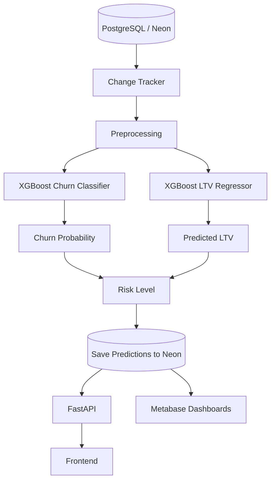

---

## Features

### Churn Prediction

The churn model returns:

- Churn prediction: `Yes` / `No`
- Churn probability

A probability threshold of **0.50** is used for the final churn classification.

```text
Probability >= 0.50  →  Churn = Yes
Probability <  0.50  →  Churn = No
```

### Customer Lifetime Value

The LTV model estimates the expected value of a customer and provides a numerical LTV prediction that can be used alongside churn risk.

### Risk Classification

The system combines the prediction results into a simple business-facing risk level:

```text
High
Medium
Low
```

### Incremental Processing

The pipeline tracks the last processed point in time and checks for customers that have been updated since the previous run.

This avoids unnecessarily processing the entire customer dataset on every execution.

### Automated Execution

The scheduler runs the prediction pipeline approximately every **5 minutes**.

### Data Flow

The following diagram shows how a customer record moves through the system, from the source database to machine-learning predictions and finally to the applications used for customer analysis and business decisions.

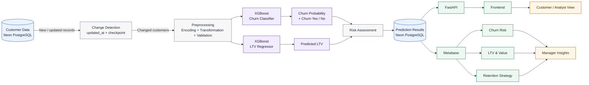

### Data-flow sequence

```text
Customer Data
      ↓
Change Detection
      ↓
Preprocessing
      ↓
 ┌───────────────┬───────────────┐
 ↓                               ↓
Churn Model                    LTV Model
 ↓                               ↓
Churn Probability              Predicted LTV
 └───────────────┬───────────────┘
                 ↓
          Risk Assessment
                 ↓
        Prediction Storage
                 ↓
        ┌────────┴────────┐
        ↓                 ↓
     FastAPI           Metabase
        ↓                 ↓
    Frontend       Manager Dashboards
```

The key point is that **both ML outputs are brought together before storage**, allowing churn risk and customer value to be analyzed together rather than as separate predictions.

# API

FastAPI provides endpoints for health checks, test data generation, and single-customer predictions.

### Dashboard

Metabase is connected directly to the PostgreSQL database and is used for manager-level analysis.

---

# Project Structure

```text
Customer-Churn-Prediction-And-Lifetime-Value-LTV-Engine/
│
├── README.md
├── requirements.txt
├── docker-compose.yml
├── .dockerignore
├── .gitignore
├── .env
│
├── backend/
│   ├── test_api_single_customer.py
│   └── dashboard_api.py
│
├── pipeline/
│   ├── main.py
│   ├── scheduler.py
│   ├── change_tracker.py
│   └── database.py
│
├── preprocessing/
│   ├── preprocessing.py
│   └── preprocessing_package.pkl
│
├── models/
│   ├── final_model.py
│   ├── ltv_model.py
│   ├── xgboost_model.json
│   └── ltv_model.json
│
├── frontend/
│   ├── test_console_single_customer.html
│   │
│   └── customer-interface/
│       ├── manager_dashboard.html
│       ├── manager_dashboard.css
│       └── manager_dashboard.js
│
├── testing/
│   └── test_data_generator.py
│
├── docker/
│   ├── Dockerfile
│   └── Dockerfile.frontend
│
└── docs/
```

---

# How the Project Works

## 1. Customer Data

Customer information is stored in **PostgreSQL through Neon**.

The database acts as the main data source for the prediction pipeline.

---

## 2. Change Detection

The pipeline checks the `updated_at` information of customer records and compares it with the previous processing checkpoint.

The checkpoint is maintained locally by:

```text
pipeline_state.json
```

The result is a set of customers that need to be processed.

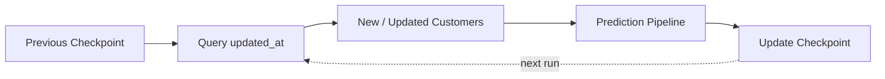

---

## 3. Preprocessing

Raw customer data is transformed into the format expected by the trained models.

The preprocessing stage handles the required:

- categorical encoding
- numerical conversion
- feature transformation
- feature validation

The saved preprocessing package is:

```text
preprocessing/preprocessing_package.pkl
```

Keeping the same preprocessing configuration during inference helps ensure that the prediction input matches the model's expected feature structure.

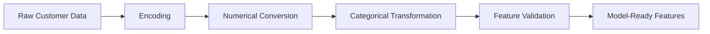

---

## 4. Churn Prediction

The churn model is stored in:

```text
models/xgboost_model.json
```

It estimates the probability that a customer will churn.

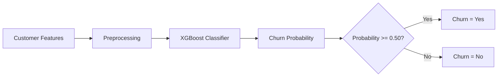

---

## 5. LTV Prediction

The lifetime value model is stored in:

```text
models/ltv_model.json
```

It predicts a numerical customer lifetime value from the processed feature set.

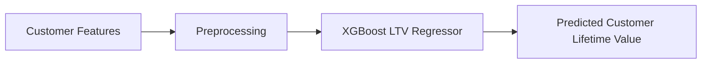

---

## 6. Risk Level

The prediction output is presented with a business-friendly risk level:

```text
Churn
Churn Probability
Predicted LTV
Risk Level
```

Example:

```text
Customer ID: CUSTOMER-001

Churn: Yes
Churn Probability: 82%
Predicted LTV: 18450
Risk Level: High
```

---

## 7. Save Results

The prediction results are written back to PostgreSQL.

This creates a central prediction dataset that can be used by:

- the API
- the frontend
- Metabase

---

# API

The backend is built with **FastAPI**.

Main file:

```text
backend/test_api_single_customer.py
```

### Available endpoints

| Method | Endpoint | Purpose |
|---|---|---|
| GET | `/` | API root |
| GET | `/health` | Health check |
| POST | `/generate-test-data` | Generate test records |
| POST | `/predict-single-customer` | Generate a prediction for a customer |

### API URL

```text
http://127.0.0.1:8000
```

### Swagger documentation

```text
http://127.0.0.1:8000/docs
```

### Health check

```text
http://127.0.0.1:8000/health
```

### Example prediction response

```json
{
  "success": true,
  "customerid": "CUSTOMER-001",
  "prediction": {
    "churn": "Yes",
    "churn_probability": 0.82,
    "predicted_ltv": 18450,
    "risk_level": "High"
  },
  "saved_to_database": true
}
```

---

# Frontend

The customer prediction interface is located at:

```text
frontend/test_console_single_customer.html
```

The frontend communicates with the FastAPI backend and displays the prediction returned by the API.

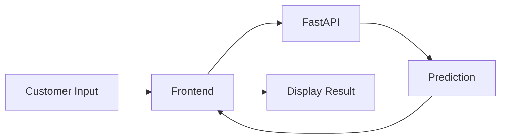

### Frontend URL

```text
http://127.0.0.1:5500
```

---

# Automated Pipeline

The main prediction workflow is implemented in:

```text
pipeline/main.py
```

The scheduler is located at:

```text
pipeline/scheduler.py
```

The scheduler invokes the pipeline approximately every 5 minutes.

## Pipeline Architecture

```mermaid
flowchart TD
    A[Scheduler] --> B[pipeline.main.run_pipeline()]
    B --> C[Read Checkpoint]
    C --> D[Find Changed Customers]
    D --> E[Fetch Customer Data]
    E --> F[Preprocessing]
    F --> G[XGBoost Churn Model]
    F --> H[XGBoost LTV Model]
    G --> I[Churn Probability + Churn]
    H --> J[Predicted LTV]
    I --> K[Risk Assessment]
    J --> K
    K --> L[Write Predictions to Neon]
    L --> M[Update Checkpoint]
    M -. next scheduled run .-> A
```

### Scheduler Flow

```text
Scheduler starts
      ↓
Initial wait
      ↓
Run prediction pipeline
      ↓
Wait approximately 5 minutes
      ↓
Run pipeline again
      ↓
Repeat
```

---

# Test Data

Controlled test data can be generated through:

```text
testing/test_data_generator.py
```

The current setup creates:

```text
150 existing customer updates
+
50 new customer records
=
200 changed records
```

Generated records use the prefix:

```text
TEST-GEN-
```

The test-data generator is separate from the prediction pipeline. It changes database records; the pipeline then detects those changes and processes them.

---

# Metabase Dashboards

Metabase connects directly to the Neon PostgreSQL database.

The project includes three manager-facing dashboards.

### 1. Customer Churn Risk Dashboard

**Question:** What is happening?

Provides an overview of current customer churn risk and the distribution of risk across the customer base.

### 2. Customer LTV & Value Dashboard

**Question:** What is it worth?

Focuses on predicted customer lifetime value and the financial importance of customers.

### 3. Churn Insights & Retention Strategy

**Question:** What should we do?

Connects churn risk and customer value so that attention can be prioritized toward customers who are both valuable and at elevated risk of leaving.

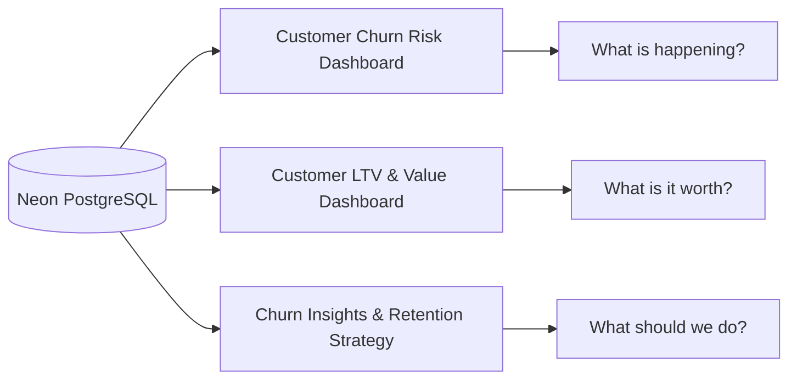

---

# Business Decision Framework

The central business use case is to combine churn risk with customer value rather than looking at either measure in isolation.

| Situation | Suggested Business Attention |
|---|---|
| Low churn + Low value | Lower priority |
| Low churn + High value | Maintain relationship |
| High churn + Low value | Monitor and evaluate |
| **High churn + High value** | **Highest retention priority** |

The most important segment is:

```text
High churn + High value
```

because these customers combine a high probability of leaving with significant financial value.

---

# Docker

The project is containerized using Docker Compose.

There are **three services**:

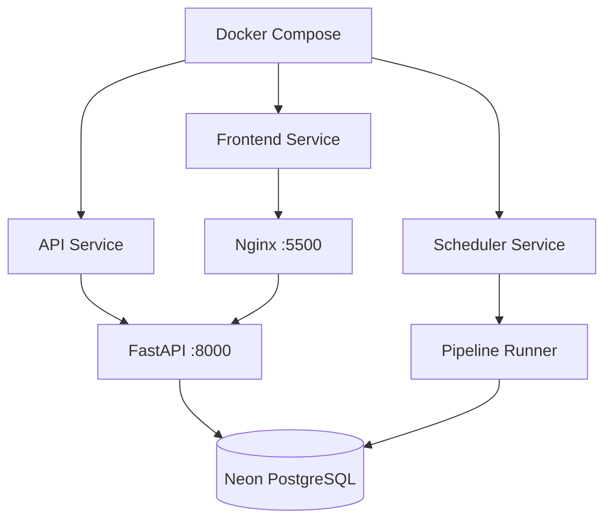

### API service

Runs the FastAPI application.

```text
churn-ltv-api
```

### Scheduler service

Runs the automated prediction scheduler.

```text
churn-ltv-scheduler
```

### Frontend service

Serves the frontend through Nginx.

```text
churn-ltv-frontend
```

There is no separate pipeline container because the scheduler directly executes the pipeline.

---

# Deployment Architecture

The application runs locally through **Docker Compose**, while **Neon PostgreSQL** provides the shared cloud database. **Metabase** connects to Neon for business analytics, and the local FastAPI service provides prediction access to the frontend.

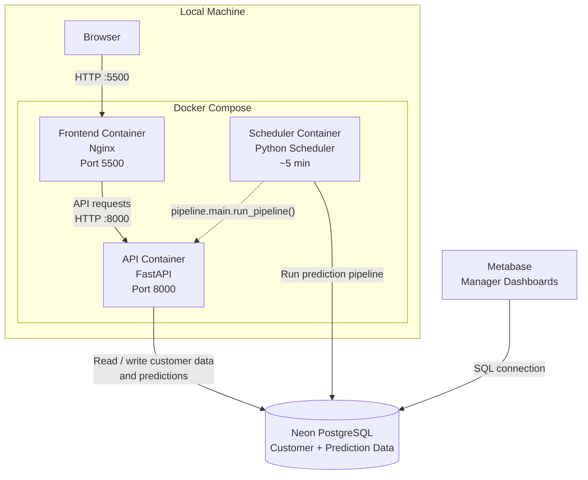

### Deployment flow

```text
Local Machine
     │
     ├── Docker Compose
     │      ├── Frontend → Nginx → :5500
     │      ├── API      → FastAPI → :8000
     │      └── Scheduler → Prediction Pipeline
     │
     └───────────────────────────────┐
                                     │
                                     ▼
                              Neon PostgreSQL
                                     │
                                     ▼
                                  Metabase
```

### Service responsibilities

| Component | Runs Where | Responsibility |
|---|---|---|
| Frontend | Local Docker container | Serves the browser interface through Nginx |
| FastAPI | Local Docker container | Handles prediction requests and API operations |
| Scheduler | Local Docker container | Executes the prediction pipeline approximately every 5 minutes |
| Neon PostgreSQL | Cloud | Stores customer and prediction data |
| Metabase | BI layer | Reads Neon data and provides manager dashboards |

# Running the Project with Docker

### 1. Build the containers

```bash
docker compose build --no-cache
```

### 2. Start the application

```bash
docker compose up -d
```

### 3. Check the containers

```bash
docker compose ps
```

Expected services:

```text
churn-ltv-api
churn-ltv-scheduler
churn-ltv-frontend
```

### 4. View logs

API:

```bash
docker compose logs api
```

Scheduler:

```bash
docker compose logs scheduler
```

Frontend:

```bash
docker compose logs frontend
```

### 5. Stop the application

```bash
docker compose down
```

---

# Running Without Docker

### Start the API

```bash
uvicorn backend.test_api_single_customer:app --host 127.0.0.1 --port 8000
```

### Start the Frontend

```bash
npx http-server frontend -p 5500
```

### Start the Scheduler

```bash
python -m pipeline.scheduler
```

---

# Application URLs

| Application | URL |
|---|---|
| Frontend | `http://127.0.0.1:5500` |
| API | `http://127.0.0.1:8000` |
| Swagger | `http://127.0.0.1:8000/docs` |
| Health Check | `http://127.0.0.1:8000/health` |

---

# Role of Each Major Component

| Component | Responsibility |
|---|---|
| `backend/` | API endpoints and prediction access |
| `pipeline/` | Coordinates data retrieval, change detection, prediction, and storage |
| `preprocessing/` | Transforms raw customer records into model-ready features |
| `models/` | Stores churn and LTV model artifacts and supporting code |
| `frontend/` | Browser-based customer prediction interface |
| `testing/` | Generates controlled test records |
| `docker/` | Container build definitions |
| `docs/` | Supporting project documentation |

---

# Configuration

Database configuration is loaded through environment variables.

Example:

```text
DB_USER=...
DB_PASSWORD=...
DB_HOST=...
DB_PORT=5432
DB_NAME=...
```

The application uses PostgreSQL through SQLAlchemy and `psycopg2`.

For deployment or public repositories, database credentials should be kept outside source control and supplied through environment variables or deployment secrets.

---

# Tech Stack

```text
Python
Pandas
NumPy
XGBoost
Scikit-learn
PostgreSQL
Neon
SQLAlchemy
psycopg2
FastAPI
Uvicorn
HTML / CSS / JavaScript
Metabase
Docker
Docker Compose
Git / GitHub
```

---

# End-to-End Flow

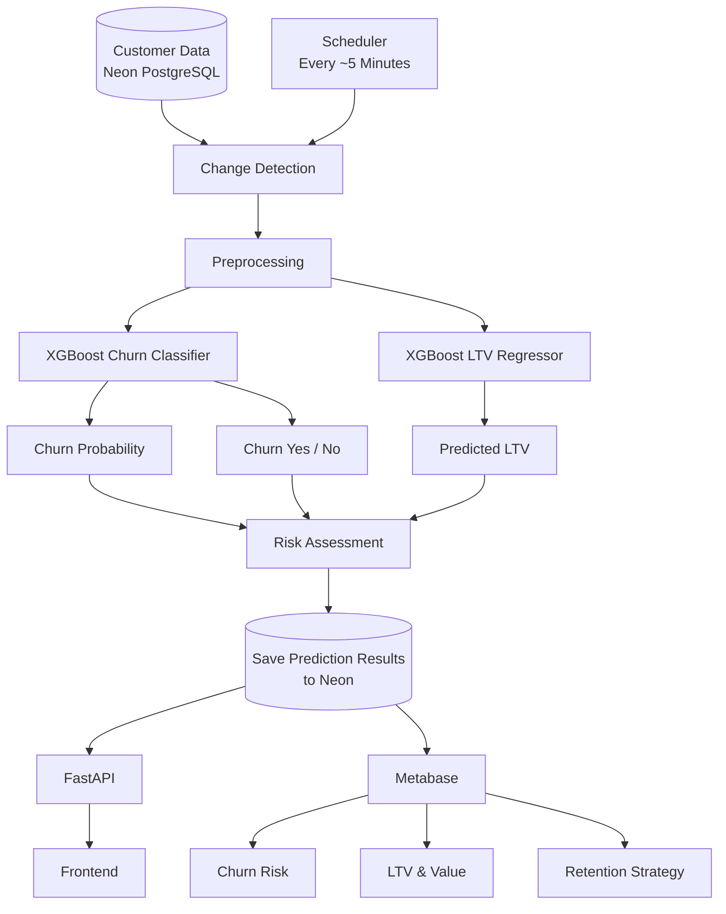

---

# Final Outcome

The project connects machine learning with the operational pieces required to use its predictions:

**data storage → preprocessing → incremental processing → prediction → risk assessment → automation → API → frontend → business intelligence**

The complete business flow is:

```text
DATA
  ↓
PREDICTION
  ↓
VALUE
  ↓
RISK
  ↓
INSIGHT
  ↓
ACTION
```

The result is an end-to-end **Customer Churn Prediction & Lifetime Value Engine** designed to turn customer-level data into actionable retention intelligence.
